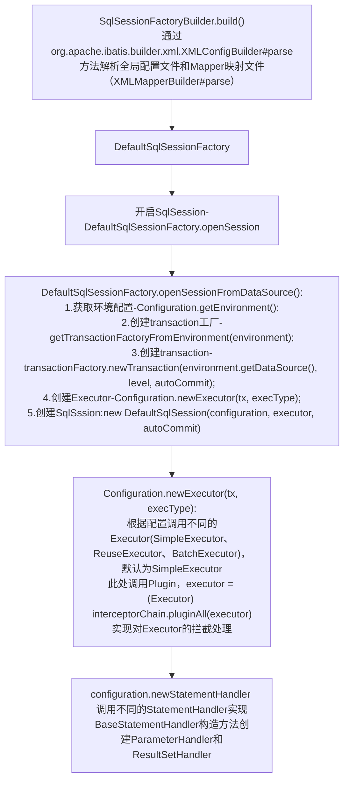
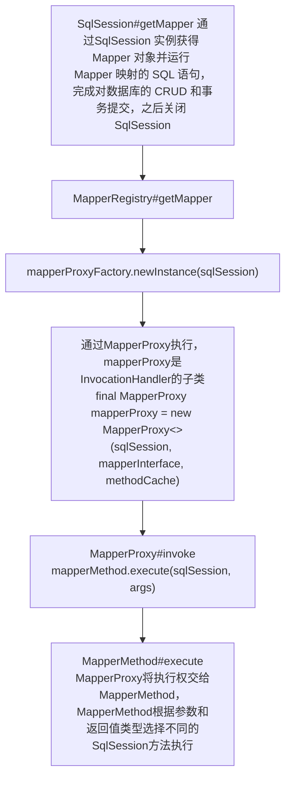

```mermaid
graph TD;
    SqlSessionFactoryBuilder.build["SqlSessionFactoryBuilder.build()<br/>通过org.apache.ibatis.builder.xml.XMLConfigBuilder#parse方法解析全局配置文件和Mapper映射文件（XMLMapperBuilder#parse）"]-->DefaultSqlSessionFactory-->开启SqlSession-DefaultSqlSessionFactory.openSession-->DefaultSqlSessionFactory.openSessionFromDataSource["DefaultSqlSessionFactory.openSessionFromDataSource():<br/>1.获取环境配置-Configuration.getEnvironment();<br/>2.创建transaction工厂-getTransactionFactoryFromEnvironment(environment);<br/>3.创建transaction-transactionFactory.newTransaction(environment.getDataSource(), level, autoCommit);<br/>4.创建Executor-Configuration.newExecutor(tx, execType);<br/>5.创建SqlSssion:new DefaultSqlSession(configuration, executor, autoCommit)"]-->Configuration.newExecutor["Configuration.newExecutor(tx, execType):<br/>根据配置调用不同的Executor(SimpleExecutor、ReuseExecutor、BatchExecutor)，默认为SimpleExecutor<br/>此处调用Plugin，executor = (Executor) interceptorChain.pluginAll(executor)实现对Executor的拦截处理"]-->configuration.newStatementHandler["configuration.newStatementHandler 调用不同的StatementHandler实现<br/>BaseStatementHandler构造方法创建ParameterHandler和ResultSetHandler"];
```

```mermaid
graph TD
	SqlSession#getMapper["SqlSession#getMapper 通过SqlSession 实例获得 Mapper 对象并运行 Mapper 映射的 SQL 语句，完成对数据库的 CRUD 和事务提交，之后关闭 SqlSession"]-->MapperRegistry#getMapper["MapperRegistry#getMapper"]-->mapperProxyFactory.newInstance["mapperProxyFactory.newInstance(sqlSession)"]-->MapperProxy["通过MapperProxy执行，mapperProxy是InvocationHandler的子类<br/>final MapperProxy<T> mapperProxy = new MapperProxy<>(sqlSession, mapperInterface, methodCache)"]-->MapperProxy#invoke["MapperProxy#invoke<br/>mapperMethod.execute(sqlSession, args)"]-->MapperMethod#execute["MapperMethod#execute<br/>MapperProxy将执行权交给MapperMethod，MapperMethod根据参数和返回值类型选择不同的SqlSession方法执行"]
```

