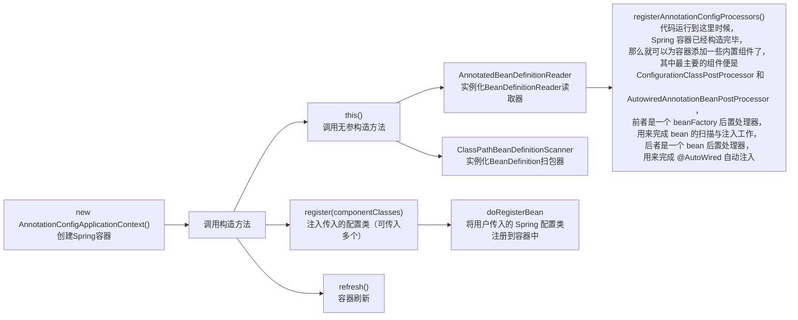
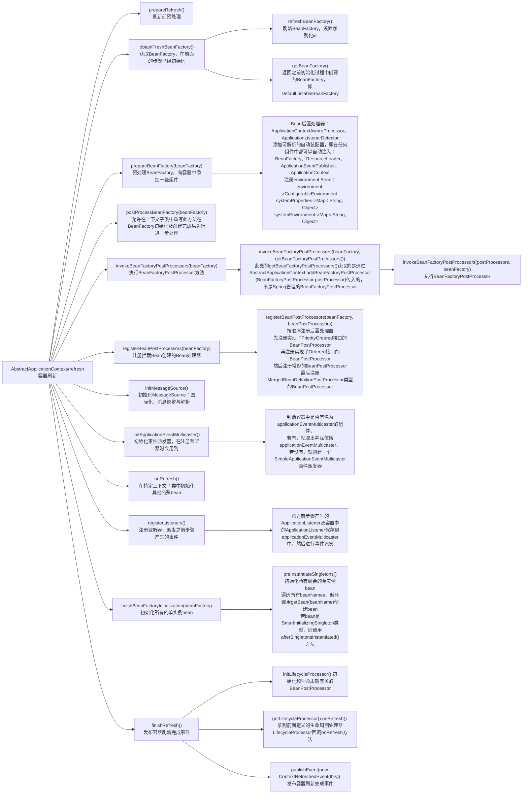

## 容器初始化

1. 生成 Bean 对象，需要 BeanFactory 工厂（`DefaultListableBeanFactory`）
2. 将加了特定注解的类（`@Controller`、`@Service`）读取转化为 BeanDefinition 对象（`BeanDefinition` 是 Spring 中极其重要的一个概念，它存储了 bean 对象的所有特征信息，如是否单例，是否懒加载，factoryBeanName 等），需要一个注解配置读取器（`AnnotatedBeanDefinitionReader`）
3. 对用户指定的包目录进行扫描查找 Bean 对象，需要一个路径扫描器（`ClassPathBeanDefinitionScanner`）

## 刷新

